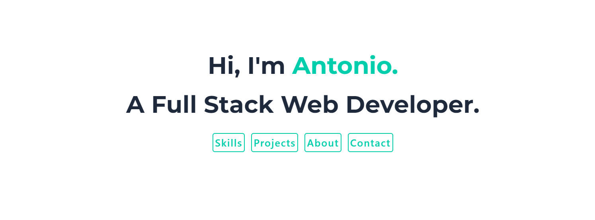

# React Portfolio

## Description 
---
A portfolio made possible using React and contains a variety of sections that include more information about myself, a section showcasing some of my best projects, a contact section where others can get in touch with me, as well as a resume that has been tailored to web development. 

## Features
---
- Responsive Design
- Links to projects and GitHub repos can be found on the Projects Section
- Links to GitHub profile, LinkedIn, and Instagram can be found at the bottom of the site
- Downloadable resume can be found at the bottom of the About Section
- Contact Section allows users to leave their emails and a message 

## Deployed Application
---

## Technologies Used
---
- JavaScript
- React
- Tailwind CSS

## Link to Deployed Application
---
https://antonio-robledo.dev
